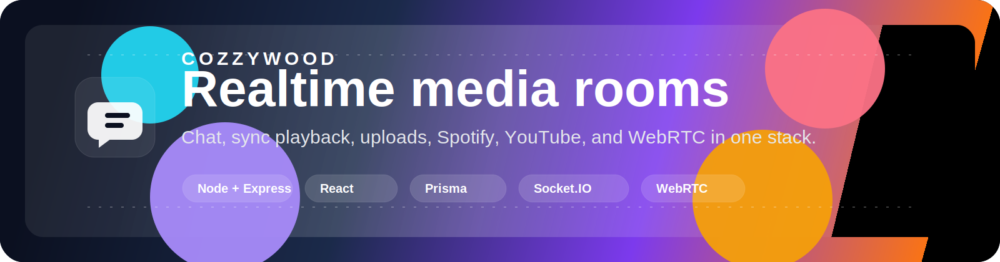

# 🍿 Cozzywood

<p align="center">
  
</p>

<p align="center">
  <a href="./package.json"></a>
  <a href="./backend/package.json"></a>
  <a href="./frontend/package.json"></a>
  <a href="./backend/prisma/schema.prisma"></a>
</p>

> **Cozzywood** is a full-stack media room platform with synchronized playback, realtime chat, uploads, Spotify and YouTube integrations, and browser-based video calls.

<p align="center">
  <strong>Three surfaces, one workspace:</strong> the root design-system demo, the backend media platform, and the frontend room client.
</p>

---

## 🗺️ Project Architecture

```text
d:\Cozzywood
├─ 🎨 src/              # Root demo / landing experience
├─ ⚙️ backend/          # API, realtime, Prisma, WebRTC signaling
└─ 📺 frontend/         # Media room client UI
```

## 🛠️ Tech Stack

### 🎨 Root demo
*  **React 18.3**
*  **Vite 5**
*  **TypeScript 5.5**
* 💫 **Framer Motion 11**
* 🖼️ **Lucide React icons**

### ⚙️ Backend
*  **Node.js 22** & Express 5
* 🔌 **Socket.IO 4** (Realtime Sync)
* 🗄️ **Prisma 6** & **PostgreSQL**
* 🔒 **JWT-based auth**
* 📡 **Peer server** (WebRTC signaling)
* 🔴 **Redis adapter** (Optional for scale-out realtime state)

### 📺 Frontend
*  **React 19**
*  **Vite 8**
* 🛣️ **React Router**
* 🌐 **Axios** & **Socket.IO client**
* 🎥 **PeerJS**, **React Player**, **Plyr**, **hls.js**
* 😊 **Emoji Mart**

---

## ✨ Features

### 🔐 Authentication
- 🛡️ Register, login, refresh, logout, and current-user profile flows
- 🔑 JWT access and refresh token handling
- 🍪 Cookie-based refresh token storage

### 🎬 Media playback
- 🚪 Protected media room route
- 📹 Unified playback for YouTube and direct URLs
- 📡 HLS playback support through hls.js and Plyr
- ☁️ Media upload endpoint with local or S3-compatible storage
- 🔄 Optional ffmpeg transcode pipeline
- 🎵 Spotify and YouTube search integrations

### ⚡ Realtime synchronization
- 🔌 JWT-protected Socket.IO connection
- 🤝 Room join/leave and state snapshot sync
- ⏱️ Sync events for source, play/pause, seek, buffering, and playback rate
- 👥 Presence updates per room
- 🧠 Redis-backed adapter and sync store when configured

### 💬 Realtime chat
- 🗣️ Authenticated chat over Socket.IO
- 🗃️ PostgreSQL persistence through Prisma
- 📜 Room history replay on join or snapshot
- 📝 Message support for text and GIF content

### 📞 WebRTC video calls
- 🎙️ Self-hosted PeerJS signaling endpoint on the backend
- 📢 In-room peer announcements over Socket.IO
- 🪟 Local and remote stream rendering in the frontend panel
- 🧊 ICE provider support for stun, Twilio, Metered, or custom servers

---

## 🚀 Run Locally

### 1️⃣ Root demo workspace

Start the root demo app:
```bash
npm install
npm run dev
```

*Useful commands:* `npm run build`, `npm run preview`

### 2️⃣ Backend service

Start the backend service:
```bash
cd backend
npm install
npx prisma generate
npx prisma migrate dev --name init
npm run dev
```

*Backend runs on http://localhost:4000.*
*Health check: `GET /api/health`*

### 3️⃣ Frontend app

Start the frontend app:
```bash
cd frontend
npm install --legacy-peer-deps
npm run dev
```

*(Note: `--legacy-peer-deps` used due to React 19 peer dependency conflicts with libraries like @emoji-mart/react)*

*Frontend runs on http://localhost:5173.*
*Useful commands:* `npm run build`, `npm run lint`, `npm run preview`

---

## ⚙️ Environment Variables

There are no committed `.env` example files in this workspace, so the source of truth is the env readers in code:
- 📖 [Backend env defaults](./backend/src/config/env.js)
- 📖 [Frontend API client defaults](./frontend/src/lib/api.js)
- 📖 [Frontend socket defaults](./frontend/src/lib/socketSync.js)

### 🖥️ Backend variables

**Minimum required for a real deployment:**
`DATABASE_URL`, `JWT_ACCESS_SECRET`, `JWT_REFRESH_SECRET`, `CLIENT_ORIGIN`

**Common optional variables:**
<details>
<summary>Click to expand</summary>

- `PORT`, `NODE_ENV`
- `ACCESS_TOKEN_TTL`, `REFRESH_TOKEN_TTL_DAYS`
- `MAX_USERS`
- `YOUTUBE_API_KEY`, `SPOTIFY_CLIENT_ID`, `SPOTIFY_CLIENT_SECRET`, `SPOTIFY_REDIRECT_URI`
- `MEDIA_STORAGE`, `MAX_UPLOAD_MB`
- `ENABLE_TRANSCODE`, `FFMPEG_PATH`
- `S3_REGION`, `S3_ENDPOINT`, `S3_BUCKET`, `S3_ACCESS_KEY_ID`, `S3_SECRET_ACCESS_KEY`, `S3_PUBLIC_BASE_URL`
- `REDIS_URL`
- `SOCKET_CORS_ORIGIN`, `SOCKET_PATH`
- `SYNC_STATE_TTL_SECONDS`, `SYNC_PRESENCE_TTL_SECONDS`
- `CHAT_HISTORY_LIMIT`, `CHAT_MAX_MESSAGE_LENGTH`
- `PEER_SERVER_PATH`, `PEER_SERVER_KEY`, `PEER_SERVER_URL`, `PEER_SERVER_PROXIED`, `PEER_SERVER_ALLOW_DISCOVERY`, `PEER_SERVER_CONCURRENT_LIMIT`, `PEER_SERVER_ALIVE_TIMEOUT_MS`, `PEER_SERVER_EXPIRE_TIMEOUT_MS`
- `WEBRTC_ICE_PROVIDER`, `WEBRTC_STUN_URLS`, `WEBRTC_ICE_TTL_SECONDS`, `WEBRTC_ICE_SERVERS_JSON`
- `TWILIO_ACCOUNT_SID`, `TWILIO_AUTH_TOKEN`
- `METERED_TURN_URLS`, `METERED_TURN_USERNAME`, `METERED_TURN_CREDENTIAL`
</details>

### 📱 Frontend variables
`VITE_API_URL`, `VITE_SOCKET_URL`, `VITE_SOCKET_PATH`

---

## 🔗 Quick Links

### 📂 Root workspace
- 📦 [Root package](./package.json) | 📖 [Root README](./README.md)
- ⚙️ [Root Vite config](./vite.config.ts) | 📜 [Root TypeScript config](./tsconfig.json) | 📜 [Node TypeScript config](./tsconfig.node.json)
- 🚀 [Landing app entry](./src/main.tsx) | 🐚 [Landing app shell](./src/App.tsx)
- 🧩 [Landing components](./src/components) | 🪝 [Theme hook](./src/hooks)

### 🖥️ Backend technical files
- 📦 [Backend package](./backend/package.json) | 🏃 [Backend process file](./backend/Procfile)
- 🚀 [Backend server entry](./backend/src/server.js) | 🔌 [Backend app wiring](./backend/src/app.js)
- ⚙️ [Backend env config](./backend/src/config/env.js) | 🗄️ [Prisma client wrapper](./backend/src/lib/prisma.js)
- 🛡️ [Auth middleware](./backend/src/middleware/requireAuth.js) | ⚡ [Realtime services](./backend/src/realtime)
- 🛣️ **Routes:** [Auth](./backend/src/routes/auth.routes.js) | [Media](./backend/src/routes/media.routes.js) | [WebRTC](./backend/src/routes/webrtc.routes.js)
- 🛠️ **Services:** [Chat](./backend/src/services/chat.service.js) | [Spotify](./backend/src/services/spotify.service.js) | [Storage](./backend/src/services/storage.service.js) | [Transcode](./backend/src/services/transcode.service.js) | [WebRTC](./backend/src/services/webrtc.service.js) | [YouTube](./backend/src/services/youtube.service.js)
- 🔑 [Token helpers](./backend/src/utils/tokens.js)
- 📊 [Prisma schema](./backend/prisma/schema.prisma) | 💾 [Chat schema migration helper](./backend/prisma/manual/phase4_chat.sql)

### 📱 Frontend technical files
- 📦 [Frontend package](./frontend/package.json) | 📖 [Frontend README](./frontend/README.md)
- ⚙️ [Frontend Vite config](./frontend/vite.config.js) | 📏 [Frontend ESLint config](./frontend/eslint.config.js)
- 📄 [Frontend HTML entry](./frontend/index.html)
- 🐚 [Frontend app shell](./frontend/src/App.jsx) | 🚀 [Frontend bootstrap](./frontend/src/main.jsx)
- 🎨 [Global styles](./frontend/src/index.css)
- 🛡️ [Auth state](./frontend/src/state/AuthContext.jsx)
- 📄 [Page layer](./frontend/src/pages)
- 🧩 [UI components](./frontend/src/components)
- 🔌 [API clients](./frontend/src/lib)
- 🖼️ [Static assets](./frontend/public)

---

## 📡 API Surface

### 🔐 Auth
- `POST /api/auth/register`
- `POST /api/auth/login`
- `POST /api/auth/refresh`
- `POST /api/auth/logout`
- `GET /api/auth/me`

### 🎬 Media
- `GET /api/media/youtube/search?q=...`
- `GET /api/media/spotify/search?q=...`
- `GET /api/media/spotify/config`
- `GET /api/media/spotify/auth-url`
- `POST /api/media/spotify/token`
- `POST /api/media/spotify/refresh`
- `POST /api/media/upload`

### 📞 WebRTC
- `GET /api/webrtc/config`
- `GET /api/webrtc/ice-servers`

---

## ⚡ Realtime Events

### 🔄 Sync
`sync:source-change`, `sync:play`, `sync:pause`, `sync:seek`, `sync:buffer`, `sync:rate-change`, `presence:update`

### 💬 Chat
`chat:send`, `chat:new`, `chat:history-request`, `chat:history`

### 📞 WebRTC
`webrtc:announce`, `webrtc:update-media`, `webrtc:clear`, `webrtc:peer-announced`, `webrtc:peer-cleared`

---

## 🗄️ Database Notes

If local chat schema setup needs a manual fallback, run:
```sql
backend/prisma/manual/phase4_chat.sql
```
The Prisma schema lives at [backend/prisma/schema.prisma](./backend/prisma/schema.prisma).

---

## 🏭 Production Notes

- Set `PEER_SERVER_PROXIED=true` when running behind a reverse proxy.
- Configure Redis when you need multi-instance Socket.IO state sharing.
- Keep frontend origin, socket origin, and backend CORS values aligned in deployment.
